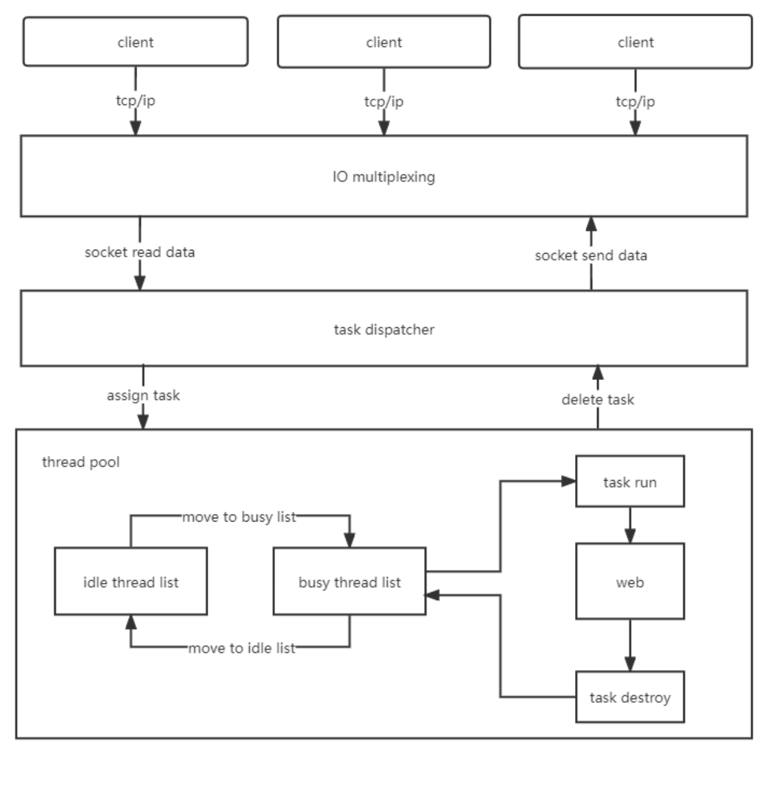
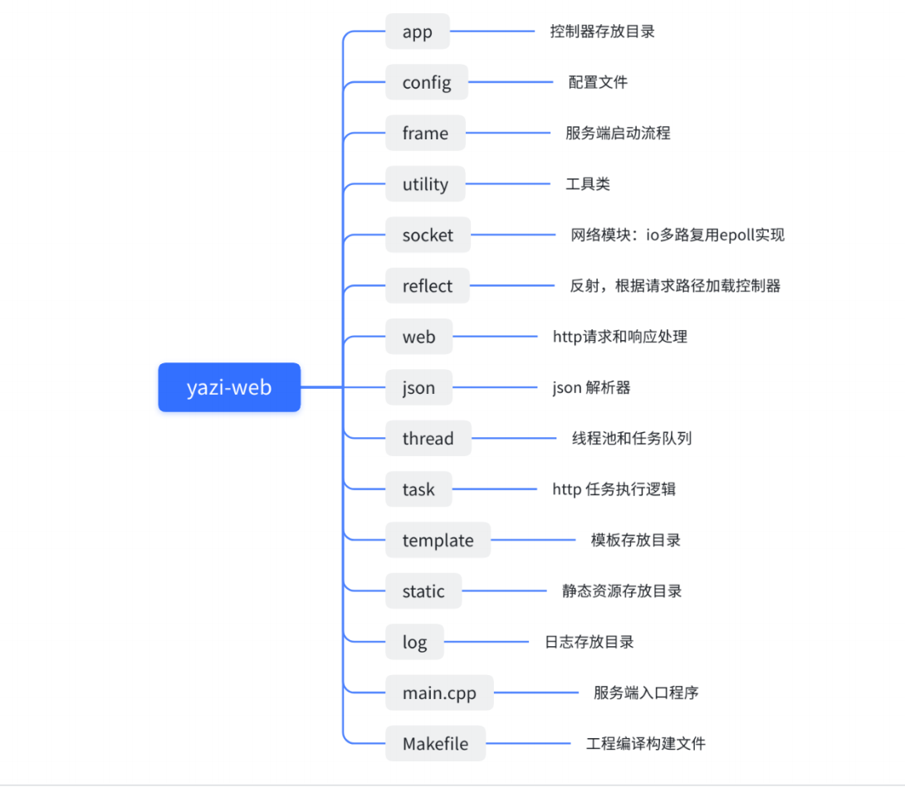

# simple web mvc frame
⼀个轻量级的 web mvc 框架

## 框架特点

1. 完全独立：不依赖任何第三方库
2. 高性能：微妙级相应
3. 高并发：单机百万连接
4. IO多路复用模型：select、poll、epoll 均支持
5. 支持 GET、POST 两种 HTTP 请求
6. 自动路由：根据 URL 路径自动匹配
7. 控制器自动加载：通过 C++ 反射技术
8. 支持 Json 数据格式
9. 静态资源文件访问
10. 文件上传

## 架构设计

## 代码结构

## Todo

- [ ] 将基于`poll`的网络模型改为基于`epoll`的网络模型
- [ ] 完善代码注释
- [ ] 完善 README
- [ ] 学习 [TinyWebServer](https://github.com/qinguoyi/TinyWebServer)，并将其功能整合到该框架
- [ ] 模块化：module
- [ ] 中间件：middleware
- [ ] 自定义路由：route、正则匹配
- [ ] cookie、session数据处理
- [ ] HTML模板引擎
- [ ] 子域名支持

## Reference

https://github.com/kaifamiao/yazi-web
