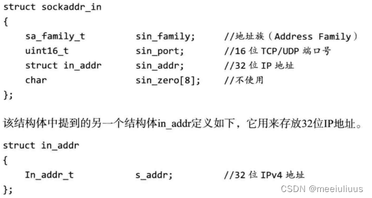

# 一、Linux 网络编程基础 API
## 1.socket地址API
### 主机字节序和网络字节序
一个32位计算机的CPU累加器一次能累加4字节的数据，而这4字节的数据在内存中排列的顺序是可以有2种方式的，即大端字节序和小端字节序

- 大端字节序：一个整数的高位字节（23~31bit）存储在内存的低地址处
- 小端字节序：一个整数的低位字节（0 ~ 7 bit）存储在内存的低地址处

由于不同的主机使用的字节序可能不同，因此两个主机之间发送数据可能会发生错误。解决方法是：制定一个规范：**发送端统一使用大端字节序（因此大端字节序称为网络字节序）而因为现代PC大多采用小端字节序，因此小端字节序称为主机字节序**


Linux中实现主机字节序和网络字节序的函数：

```cpp
#include<netinet/in.h>
unsigned long int htonl(unsigned long int hostlong);
unsigned short int htons(unsigned short int hostshort);
unsigned long int ntohl(unsigned long int netlong);
unsigned short int ntohs(unsigned short int netshort);
```

其作用可以通过名字理解，比如 htonl :" host to network long" ，即长整型的主机字节序转换成网络字节序。这四个函数中long类型的函数一般用来转换IP地址，short类型的一般用来转换端口号（操作系统基础知识）

### 通用socket地址

主机之间的通信需要知晓对方的地址，而网络中主机的地址是TCP/IP协议族来定义的（计算机网络基础知识），在Linux网络编程中，通过使用socket的这个套接字来进行网络通信。socket定义了一系列的API实现网络通信，是非常方便好用的工具。

在socket网络编程中表示地址的是结构体`sockaddr`，但由于这个结构体的设计问题，无法容纳多数协议族的地址值，因此Linux定义了一个新的通用socket地址结构体

```cpp
#include<bits/socket.h>
struct sockaddr_storge
{
    sa_family_t sa_family;
    unsigned long int __ss_align;
    char__ss_padding[128-sizeof(__ss_align)];
}
```

###  专用socket地址

以上两种通用socket地址其实并不好用，所以Linux为各个协议族提供了专门的socket地址结构体

其中，UNIX本地协议族使用`sockaddr_un`，而TCP/IP协议族使用`sockaddr_in`和`sockaddr_in6`两个分别对应IPv4和IPv6



但需要注意的是，使用`sockaddr_in`或其他专用socket地址（包括`socket_storge`)，最后都要**强制转换**成通用socket地址类型`sockaddr`，这是**因为所有socket编程接口使用的地址参数的类型都是`sockaddr`**

## 2.创建socket

> ```cpp
> int socket(int domain,int type,int protocol);
> ```
> 功能：用于创建一个套接字（socket）的系统调用
>
> 参数：
>
> - domain：协议族
> 	- AF_INET：IPv4
> 	- AF_INET6: IPv6
> 	- AF_UNIX，AF_LOCAL：本地套接字通信
> - type：通信过程中使用的协议类型
> 	- SOCK_STEAM：流式协议(传输层使用TCP协议）
> 	- SOCK_DGRAM：数据报式协议（传输层使用UDP协议）
> - protocol 指定套接字使用的具体协议。在指定协议族和套接字类型后，通常会使用 0 作为协议参数，让系统根据前两个参数的取值自动选择合适的协议。对于特定的协议，可以指定具体的协议号，如 `IPPROTO_TCP`、`IPPROTO_UDP` 等。
>
> 返回值：如果套接字创建成功，则返回一个非负整数值，用于后续的套接字操作。如果创建套接字失败，返回-1，并设置全局变量 `errno` 表示具体的错误类型。可以通过一下方式打印出错误信息：
>
> ```cpp
> printf("socket error: errno=%d errmsg=%s\n", errno, strerror(errno));
> ```

创建socket的代码

```cpp
#include <sys/socket.h>
#include <netinet/in.h>
#include <arpa/inet.h>
#include <cstring>
#include <string>
using std::string;

// 1、创建 socket
int sockfd = ::socket(AF_INET, SOCK_STREAM, IPPROTO_TCP);
```

## 3.绑定socket（bind)

在创建套接字时，通过指定协议族（例如，IPv4 `AF_INET` 或 IPv6 `AF_INET6`）来确定套接字使用的地址族。但是，并没有指定具体使用该地址族中的哪个具体地址。

要为套接字指定具体的地址，需要使用系统调用 `bind()`将套接字与特定的 IP 地址和端口号绑定在一起，以便服务端能够监听该地址上的连接。这样，当客户端发起连接时，服务端就能接受并处理连接请求。

**注**：而对于客户端，通常采用匿名绑定（anonymous bind），也就是不需要显式调用 `bind()`。在客户端创建套接字后，操作系统会自动为其分配一个临时的本地地址，并将其与套接字关联起来。这样，客户端在发起连接时，操作系统会使用该临时地址作为源地址，与服务端进行通信。

> ```cpp
> int bind(int sockfd, const struct sockaddr* my_addr, socklen_t addrlen);
> ```
>
> 功能：将套接字与指定的地址绑定起来。
>
> 参数：
>
> - `sockfd`：要绑定地址的套接字描述符。
> - `my_addr`：指向要绑定的地址结构体的指针。根据套接字的地址族不同，可以是 `struct sockaddr_in`（IPv4）或 `struct sockaddr_in6`（IPv6）。
> - `addrlen`：`my_addr` 结构体的长度。
>
> 返回值：成功绑定返回0，失败返回-1，并设置全局变量 `errno` 表示具体的错误类型。

绑定过程：

```cpp
// 2、绑定 socket
string ip = "127.0.0.1";
int port = 8080;
struct sockaddr_in sockaddr;
std::memset(&sockaddr, 0, sizeof(sockaddr)); // 参数重置为 0
sockaddr.sin_family = AF_INET;
sockaddr.sin_addr.s_addr = inet_addr(ip.c_str()); // 使用网络统一的编码
sockaddr.sin_port = htons(port); // 使用网络统一的编码
bind(sockfd, (struct sockaddr*)&sockaddr, sizeof(sockaddr)); // sockaddr_in 强制转换为 sockaddr
```

其中，`inet_addr`用于将点分十进制形式的 IP 地址转换为32位无符号整数形式的网络字节序（大端字节序）的IP地址。

## 4.监听socket（listen）

> ```cpp
> int listen(int sockfd, int backlog);
> ```
>
> 功能：将套接字设置为监听模式，准备接受连接请求。
>
> 参数：
>
> - `sockfd`：要设置为监听模式的套接字描述符。
> - `backlog`：等待连接队列的最大长度，未连接的和已经连接的和的最大值。
>
> 返回值：成功返回0，失败返回-1，并设置全局变量 `errno` 表示具体的错误类型。

监听过程：

```cpp
listen(sockfd, 1024);
```

## 5.接收连接——服务端（accept）

有了一个监听socket（执行过listen调用，处于LISTEN状态的socket），就可以进行通信。而最后一步，就是将监听队列中的一个socket取出来，即可与远端的主机进行读写交互了。

> ```cpp
> int accept(int sockfd, struct sockaddr* addr, socklen_t* addrlen);
> ```
>
> 功能：接受客户端的连接请求，并创建一个新的套接字来与客户端进行通信。
>
> 参数：
>
> - `sockfd`：监听套接字描述符，即之前通过 `socket()` 和 `bind()` 设置为监听模式的套接字。
> - `addr`：用于存储客户端的地址信息。可以传入 `nullptr`，表示不关心客户端的地址信息。
> - `addrlen`：用于指定 `addr` 缓冲区的大小。同样，通过传入 `nullptr`，表示不关心客户端的地址信息的长度。
>
> 返回值：如果成功接受连接请求，则返回一个新的套接字描述符，用于与客户端进行通信。如果出现错误，返回-1，并设置全局变量 `errno` 表示具体的错误类型。

接收连接过程（通常在一个 `while(true)` 循环中）：

```cpp
// 4、接收客户端连接
int connfd = ::accept(sockfd, nullptr, nullptr);
```

## 6.发起连接——客户端（connect）

绑定socket，监听socket和接受连接都是服务端要干的事，在服务端创建好了监听队列后，就可以接受来自客户端的连接请求。客户端通过`connect`发起连接请求。

> ```
> int connect(int sockfd, const struct sockaddr* serv_addr, socklen_t addrlen);
> ```
>
> 功能：与指定的服务器建立连接。
>
> 参数：
>
> - `sockfd`：套接字描述符，用于标识本地套接字。
> - `serv_addr`：指向目标服务器地址的指针。可以是 `struct sockaddr_in` 或 `struct sockaddr_in6`，取决于使用的 IP 地址类型。
> - `addrlen`：指定 `serv_addr` 缓冲区的大小。
>
> 返回值：如果连接成功建立，返回 0；如果出现错误，返回 -1，并设置全局变量 `errno` 表示具体的错误类型。

发起连接过程：

```cpp
// 2、连接服务端
string ip = "127.0.0.1";
int port = 8080;
struct sockaddr_in sockaddr;
std::memset(&sockaddr, 0, sizeof(sockaddr)); // 参数重置为 0
sockaddr.sin_family = AF_INET;
sockaddr.sin_addr.s_addr = inet_addr(ip.c_str()); // 使用网络统一的编码
sockaddr.sin_port = htons(port); // 使用网络统一的编码
connect(sockfd, (struct sockaddr*)&sockaddr, sizeof(sockaddr); // sockaddr_in 强制转换为 sockaddr
```

## 7.关闭连接（close）

通信完成后，如要关闭连接，可以通过下面的系统调用

> ```cpp
> int close(int fd);
> ```
>
> 功能：关闭指定的文件描述符。
>
> 参数：
>
> - `fd`：要关闭的文件描述符。
>
> 返回值：成功关闭文件描述符返回 0，失败返回 -1，并设置全局变量 `errno` 表示具体的错误类型。

关闭连接：

```cpp
close(sockfd);
```

## 8.数据收发（send, recv）

在进行 socket 通信期间，连接建立成功后，可以进行两个主机之间的通信。对于 TCP 协议，可以使用 `recv()` 和 `send()` 函数进行数据收发。

> ```cpp
> ssize_t recv(int sockfd, void* buf, size_t len, int flags);
> ssize_t send(int sockfd, const void* buf, size_t len, int flags);
> ```
>
> 功能：进行数据读写操作。
>
> 参数：
>
> - `sockfd`：用于通信的文件描述符，即套接字描述符。
> - `buf`：数据缓冲区的位置，即存储读取或发送数据的内存地址。
> - `len`：缓冲区的大小，即期望读取或发送的数据长度。
> - `flags`：通常取 0，表示没有特殊的控制标志，其他取值可以进行具体的控制，具体含义可以查阅相关文档或资料。
>
> 返回值：
>
> - 成功：
>   - `recv()`：返回实际读取到的数据的长度。如果返回值小于期望长度 `len`，可能是缓冲区中没有足够的数据，可以多次调用 `recv()` 进行读取。
>   - `send()`：返回实际成功写入的数据长度。
> - 失败：返回 -1，并设置全局变量 `errno` 表示具体的错误类型。

收发过程：

```cpp
// 5、接收客户端的数据
char buf[1024] = { 0 };
size_t len = ::recv(connfd, buf, sizeof(buf), 0);
printf("recv: connfd=%d msg=%s\n", connfd, buf);

// 6、向客户端发送数据
::send(connfd, buf, len, 0); // 原数据返回给客户端
```

