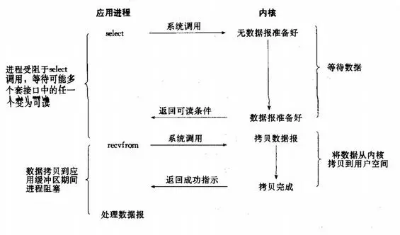

**参考资料**：

- [从零开始制作一个Webserver](https://blog.csdn.net/qq_52313711/category_12551665.html)

- [Select、Poll、Epoll详解](https://www.jianshu.com/p/722819425dbd/)

- [如果这篇文章说不清epoll的本质，那就过来掐死我吧！](https://zhuanlan.zhihu.com/p/63179839)

# 一、Linux 网络编程基础 API

## 1.socket地址API
### 主机字节序和网络字节序
一个32位计算机的CPU累加器一次能累加4字节的数据，而这4字节的数据在内存中排列的顺序是可以有2种方式的，即大端字节序和小端字节序

- 大端字节序：一个整数的高位字节（23~31bit）存储在内存的低地址处
- 小端字节序：一个整数的低位字节（0 ~ 7 bit）存储在内存的低地址处

由于不同的主机使用的字节序可能不同，因此两个主机之间发送数据可能会发生错误。解决方法是：制定一个规范：**发送端统一使用大端字节序（因此大端字节序称为网络字节序）而因为现代PC大多采用小端字节序，因此小端字节序称为主机字节序**


Linux中实现主机字节序和网络字节序的函数：

```cpp
#include<netinet/in.h>
unsigned long int htonl(unsigned long int hostlong);
unsigned short int htons(unsigned short int hostshort);
unsigned long int ntohl(unsigned long int netlong);
unsigned short int ntohs(unsigned short int netshort);
```

其作用可以通过名字理解，比如 htonl :" host to network long" ，即长整型的主机字节序转换成网络字节序。这四个函数中long类型的函数一般用来转换IP地址，short类型的一般用来转换端口号（操作系统基础知识）

### 通用socket地址

主机之间的通信需要知晓对方的地址，而网络中主机的地址是TCP/IP协议族来定义的（计算机网络基础知识），在Linux网络编程中，通过使用socket的这个套接字来进行网络通信。socket定义了一系列的API实现网络通信，是非常方便好用的工具。

在socket网络编程中表示地址的是结构体`sockaddr`，但由于这个结构体的设计问题，无法容纳多数协议族的地址值，因此Linux定义了一个新的通用socket地址结构体

```cpp
#include<bits/socket.h>
struct sockaddr_storge
{
    sa_family_t sa_family;
    unsigned long int __ss_align;
    char__ss_padding[128-sizeof(__ss_align)];
}
```

###  专用socket地址

以上两种通用socket地址其实并不好用，所以Linux为各个协议族提供了专门的socket地址结构体

其中，UNIX本地协议族使用`sockaddr_un`，而TCP/IP协议族使用`sockaddr_in`和`sockaddr_in6`两个分别对应IPv4和IPv6


但需要注意的是，使用`sockaddr_in`或其他专用socket地址（包括`socket_storge`)，最后都要**强制转换**成通用socket地址类型`sockaddr`，这是**因为所有socket编程接口使用的地址参数的类型都是`sockaddr`**

## 2.创建socket

> ```cpp
> int socket(int domain,int type,int protocol);
> ```
> 功能：用于创建一个套接字（socket）的系统调用
>
> 参数：
>
> - domain：协议族
> 	- AF_INET：IPv4
> 	- AF_INET6: IPv6
> 	- AF_UNIX，AF_LOCAL：本地套接字通信
> - type：通信过程中使用的协议类型
> 	- SOCK_STEAM：流式协议(传输层使用TCP协议）
> 	- SOCK_DGRAM：数据报式协议（传输层使用UDP协议）
> - protocol 指定套接字使用的具体协议。在指定协议族和套接字类型后，通常会使用 0 作为协议参数，让系统根据前两个参数的取值自动选择合适的协议。对于特定的协议，可以指定具体的协议号，如 `IPPROTO_TCP`、`IPPROTO_UDP` 等。
>
> 返回值：如果套接字创建成功，则返回一个非负整数值，用于后续的套接字操作。如果创建套接字失败，返回-1，并设置全局变量 `errno` 表示具体的错误类型。可以通过一下方式打印出错误信息：
>
> ```cpp
> printf("socket error: errno=%d errmsg=%s\n", errno, strerror(errno));
> ```

创建socket的代码

```cpp
#include <sys/socket.h>
#include <netinet/in.h>
#include <arpa/inet.h>
#include <cstring>
#include <string>
using std::string;

// 1、创建 socket
int sockfd = ::socket(AF_INET, SOCK_STREAM, IPPROTO_TCP);
```

## 3.绑定socket（bind)

在创建套接字时，通过指定协议族（例如，IPv4 `AF_INET` 或 IPv6 `AF_INET6`）来确定套接字使用的地址族。但是，并没有指定具体使用该地址族中的哪个具体地址。

要为套接字指定具体的地址，需要使用系统调用 `bind()`将套接字与特定的 IP 地址和端口号绑定在一起，以便服务端能够监听该地址上的连接。这样，当客户端发起连接时，服务端就能接受并处理连接请求。

**注**：而对于客户端，通常采用匿名绑定（anonymous bind），也就是不需要显式调用 `bind()`。在客户端创建套接字后，操作系统会自动为其分配一个临时的本地地址，并将其与套接字关联起来。这样，客户端在发起连接时，操作系统会使用该临时地址作为源地址，与服务端进行通信。

> ```cpp
> int bind(int sockfd, const struct sockaddr* my_addr, socklen_t addrlen);
> ```
>
> 功能：将套接字与指定的地址绑定起来。
>
> 参数：
>
> - `sockfd`：要绑定地址的套接字描述符。
> - `my_addr`：指向要绑定的地址结构体的指针。根据套接字的地址族不同，可以是 `struct sockaddr_in`（IPv4）或 `struct sockaddr_in6`（IPv6）。
> - `addrlen`：`my_addr` 结构体的长度。
>
> 返回值：成功绑定返回0，失败返回-1，并设置全局变量 `errno` 表示具体的错误类型。

绑定过程：

```cpp
// 2、绑定 socket
string ip = "127.0.0.1";
int port = 8080;
struct sockaddr_in sockaddr;
std::memset(&sockaddr, 0, sizeof(sockaddr)); // 参数重置为 0
sockaddr.sin_family = AF_INET;
sockaddr.sin_addr.s_addr = inet_addr(ip.c_str()); // 使用网络统一的编码
sockaddr.sin_port = htons(port); // 使用网络统一的编码
bind(sockfd, (struct sockaddr*)&sockaddr, sizeof(sockaddr)); // sockaddr_in 强制转换为 sockaddr
```

其中，`inet_addr`用于将点分十进制形式的 IP 地址转换为32位无符号整数形式的网络字节序（大端字节序）的IP地址。

## 4.监听socket（listen）

> ```cpp
> int listen(int sockfd, int backlog);
> ```
>
> 功能：将套接字设置为监听模式，准备接受连接请求。
>
> 参数：
>
> - `sockfd`：要设置为监听模式的套接字描述符。
> - `backlog`：等待连接队列的最大长度，未连接的和已经连接的和的最大值。
>
> 返回值：成功返回0，失败返回-1，并设置全局变量 `errno` 表示具体的错误类型。

监听过程：

```cpp
listen(sockfd, 1024);
```

## 5.接收连接——服务端（accept）

有了一个监听socket（执行过listen调用，处于LISTEN状态的socket），就可以进行通信。而最后一步，就是将监听队列中的一个socket取出来，即可与远端的主机进行读写交互了。

> ```cpp
> int accept(int sockfd, struct sockaddr* addr, socklen_t* addrlen);
> ```
>
> 功能：接受客户端的连接请求，并创建一个新的套接字来与客户端进行通信。
>
> 参数：
>
> - `sockfd`：监听套接字描述符，即之前通过 `socket()` 和 `bind()` 设置为监听模式的套接字。
> - `addr`：用于存储客户端的地址信息。可以传入 `nullptr`，表示不关心客户端的地址信息。
> - `addrlen`：用于指定 `addr` 缓冲区的大小。同样，通过传入 `nullptr`，表示不关心客户端的地址信息的长度。
>
> 返回值：如果成功接受连接请求，则返回一个新的套接字描述符，用于与客户端进行通信。如果出现错误，返回-1，并设置全局变量 `errno` 表示具体的错误类型。

接收连接过程（通常在一个 `while(true)` 循环中）：

```cpp
// 4、接收客户端连接
int connfd = ::accept(sockfd, nullptr, nullptr);
```

## 6.发起连接——客户端（connect）

绑定socket，监听socket和接受连接都是服务端要干的事，在服务端创建好了监听队列后，就可以接受来自客户端的连接请求。客户端通过`connect`发起连接请求。

> ```
> int connect(int sockfd, const struct sockaddr* serv_addr, socklen_t addrlen);
> ```
>
> 功能：与指定的服务器建立连接。
>
> 参数：
>
> - `sockfd`：套接字描述符，用于标识本地套接字。
> - `serv_addr`：指向目标服务器地址的指针。可以是 `struct sockaddr_in` 或 `struct sockaddr_in6`，取决于使用的 IP 地址类型。
> - `addrlen`：指定 `serv_addr` 缓冲区的大小。
>
> 返回值：如果连接成功建立，返回 0；如果出现错误，返回 -1，并设置全局变量 `errno` 表示具体的错误类型。

发起连接过程：

```cpp
// 2、连接服务端
string ip = "127.0.0.1";
int port = 8080;
struct sockaddr_in sockaddr;
std::memset(&sockaddr, 0, sizeof(sockaddr)); // 参数重置为 0
sockaddr.sin_family = AF_INET;
sockaddr.sin_addr.s_addr = inet_addr(ip.c_str()); // 使用网络统一的编码
sockaddr.sin_port = htons(port); // 使用网络统一的编码
connect(sockfd, (struct sockaddr*)&sockaddr, sizeof(sockaddr); // sockaddr_in 强制转换为 sockaddr
```

## 7.关闭连接（close）

通信完成后，如要关闭连接，可以通过下面的系统调用

> ```cpp
> int close(int fd);
> ```
>
> 功能：关闭指定的文件描述符。
>
> 参数：
>
> - `fd`：要关闭的文件描述符。
>
> 返回值：成功关闭文件描述符返回 0，失败返回 -1，并设置全局变量 `errno` 表示具体的错误类型。

关闭连接：

```cpp
close(sockfd);
```

## 8.数据收发（send, recv）

在进行 socket 通信期间，连接建立成功后，可以进行两个主机之间的通信。对于 TCP 协议，可以使用 `recv()` 和 `send()` 函数进行数据收发。

> ```cpp
> ssize_t recv(int sockfd, void* buf, size_t len, int flags);
> ssize_t send(int sockfd, const void* buf, size_t len, int flags);
> ```
>
> 功能：进行数据读写操作。
>
> 参数：
>
> - `sockfd`：用于通信的文件描述符，即套接字描述符。
> - `buf`：数据缓冲区的位置，即存储读取或发送数据的内存地址。
> - `len`：缓冲区的大小，即期望读取或发送的数据长度。
> - `flags`：通常取 0，表示没有特殊的控制标志，其他取值可以进行具体的控制，具体含义可以查阅相关文档或资料。
>
> 返回值：
>
> - 成功：
>   - `recv()`：返回实际读取到的数据的长度。如果返回值小于期望长度 `len`，可能是缓冲区中没有足够的数据，可以多次调用 `recv()` 进行读取。
>   - `send()`：返回实际成功写入的数据长度。
> - 失败：返回 -1，并设置全局变量 `errno` 表示具体的错误类型。

收发过程：

```cpp
// 5、接收客户端的数据
char buf[1024] = { 0 };
size_t len = ::recv(connfd, buf, sizeof(buf), 0);
printf("recv: connfd=%d msg=%s\n", connfd, buf);

// 6、向客户端发送数据
::send(connfd, buf, len, 0); // 原数据返回给客户端
```

# 二、其他

## 1.高级I/O函数

### pipe 函数

> ```cpp
> #include <unistd.h>
> int pipe(int fd[2]);
> ```
>
> 功能：用于创建一个**半双工的**管道，用于实现具有亲缘关系的进程之间的通信。管道由操作系统创建，并为调用进程分配一个读取端和一个写入端的文件描述符。通过这两个文件描述符，亲缘关系的进程可以在管道中进行双向的数据传输。
>
> 参数：
> - `fd`：整型数组，长度为2
> 	- `fd[0]`: 从管道中读出的文件描述符
> 	- `fd[1]`: 往管道中写入的文件描述符
> 	- 1是写0是读，先1后0
>
> 返回值：
> - 成功创建返回0，失败：返回-1。
>

### dup 函数和 dup2 函数

> ```cpp
> #include <unistd.h>
> int dup(int file_descriptor);
> ```
>
> 功能：用于复制文件描述符 `file_descriptor`，并返回新的文件描述符。
>
> 参数：
> - file_descriptor：要复制的文件描述符。
>
> 返回值：
> - 成功复制返回新的文件描述符，失败返回-1。

> ```cpp
> #include <unistd.h>
> int dup2(int file_descriptor_one, int file_descriptor_two);
> ```
>
> 功能：用于将源文件描述符 `file_descriptor_one` 复制到目标文件描述符 `file_descriptor_two`。如果目标文件描述符 `file_descriptor_two` 已经打开，则会先关闭它，然后将源文件描述符复制到目标文件描述符。
>
> 参数：
> - file_descriptor_one：源文件描述符。
> - file_descriptor_two：目标文件描述符。
>
> 返回值：
> - 成功返回目标文件描述符的值，失败返回-1

### readv 函数和 writev 函数

> ```cpp
> #include <sys/uio.h>
> ssize_t readv(int fd, const struct iovec* vector, int count);
> ```
>
> 功能：将文件描述符内的数据**分散读**到的内存块中
>
> 参数：
>
> - `fd`：要读取的文件描述符。
> - `vector`：指向 `iovec` 结构体数组的指针，每个结构体描述一个缓冲区的地址和长度。
> - `count`：`iovec` 结构体数组的元素个数。
>
> 返回值：
>
> - 成功返回实际读取的字节数，失败返回-1。

> ```cpp
> #include <sys/uio.h>
> ssize_t writev(int fd, const struct iovec* vector, int count);
> ```
>
> 功能：将分散的内存中数据**集中写**到文件描述符中。
>
> 参数：
>
> - `fd`：要写入的文件描述符。
> - `vector`：指向 `iovec` 结构体数组的指针，每个结构体描述一个缓冲区的地址和长度。
> - `count`：`iovec` 结构体数组的元素个数。
>
> 返回值：
>
> - 成功返回实际写入的字节数，失败返回-1。

HTTP应答可以用 writev 函数实现

### sendfile 函数

> ```cpp
> #include <sys/sendfile.h>
> ssize_t sendfile(int out_fd, int in_fd, off_t offset, size_t count);
> ```
>
> 功能：在两个文件描述符之间直接传输数据，而无需将数据从内核空间复制到用户空间，从而提高数据传输的效率。它通常用于在网络编程中将文件数据发送到套接字，或者在文件之间进行数据传输。
>
> 参数：
>
> - `out_fd`：目标文件描述符，数据将被传输到此文件描述符。
> - `in_fd`：源文件描述符，数据将从此文件描述符读取。
> - `offset`：源文件的偏移量，表示从源文件的哪个位置开始读取数据。
> - `count`：要传输的数据的大小，以字节数表示。
>
> 返回值：
>
> - 成功传输返回实际传输的字节数，返回-1。

### mmap 函数和 munmap 函数

> ```cpp
> #include <sys/mman.h>
> void* mmap(void* start, size_t length, int prot, int flags, int fd, off_t offset);
> ```
>
> 功能：将文件或者设备映射到进程的内存空间中，从而使得进程可以通过内存访问文件或者设备的内容。即申请一块进程间进行通信的共享内存。
>
> 参数：
>
> - `start`：映射的起始地址，通常设置为 `NULL`，由系统自动选择合适的地址。
> - `length`：映射的长度，以字节为单位。
> - `prot`：内存保护模式，指定内存区域的访问权限，包括 `PROT_NONE`、`PROT_READ`、`PROT_WRITE` 和 `PROT_EXEC` 等。
> - `flags`：映射的标志，控制映射的特性，包括 `MAP_SHARED`、`MAP_PRIVATE`、`MAP_FIXED` 等。
> - `fd`：要映射的文件描述符，或者是 `MAP_ANONYMOUS` 标志用于映射匿名内存。
> - `offset`：映射的文件偏移量，表示从文件的哪个位置开始映射，对于匿名内存映射可设置为 0。
>
> 返回值：
>
> - 成功返回映射区的起始地址，返回 `MAP_FAILED`（-1）。

> ```cpp
> #include <sys/mman.h>
> int munmap(void* start, size_t length);
> ```
>
> 功能：用于解除对内存区域的映射，使得该内存区域不再与文件或设备关联。解除映射后，进程将无法继续访问和操作这部分内存。
>
> 参数：
>
> - `start`：要解除映射的起始地址。
> - `length`：要解除映射的长度，以字节为单位。
>
> 返回值：
>
> - 成功返回0，失败返回-1。

### splice 函数

> ```cpp
> #include <fcntl.h>
> ssize_t splice(int fd_in, loff_t* off_in, int fd_out, loff_t* off_out, size_t len, unsigned int flags);
> ```
>
> 功能：两个文件描述符之间**零拷贝**地移动数据（类似ctrl+x -> ctrl+v)
>
> 参数：
>
> - `fd_in`：源文件描述符，从该文件描述符读取数据。
> - `off_in`：源文件的偏移量指针，表示从源文件的哪个位置开始读取数据。可以为 `NULL`，表示从当前位置开始读取。
> - `fd_out`：目标文件描述符，将数据传输到该文件描述符。
> - `off_out`：目标文件的偏移量指针，表示将数据写入目标文件的哪个位置。可以为 `NULL`，表示从当前位置开始写入。
> - `len`：要传输的数据的长度，以字节数表示。
> - `flags`：传输标记，控制传输的行为，例如 `SPLICE_F_MOVE`、`SPLICE_F_NONBLOCK` 等。
>
> 返回值：
>
> - 成功：返回实际传输的字节数，返回-1。

一般两个splice函数成对使用，一个往管道里写，一个从管道里读

### tee 函数

> ```cpp
> #include <fcntl.h>
> ssize_t tee(int fd_in, int fd_out, size_t len, unsigned int flags);
> ```
>
> 功能：在两个文件描述符之间复制数据，不绕过用户空间。（类似ctrl+c -> ctrl+v）
>
> 参数：
>
> - `fd_in`：源文件描述符，从该文件描述符读取数据。
> - `fd_out`：目标文件描述符，将数据复制到该文件描述符。
> - `len`：要复制的数据的长度，以字节数表示。
> - `flags`：复制标记，控制复制的行为，例如 `O_NONBLOCK` 等。
>
> 返回值：
>
> - 成功返回实际复制的字节数，失败返回-1。

调用 `tee` 函数后，数据将从源文件描述符读取到用户空间缓冲区，然后再从用户空间缓冲区复制到目标文件描述符。这种复制方式涉及用户空间和内核空间之间的数据拷贝，效率相对较低。与 `splice` 函数相比，`tee` 函数的主要优点是可以在复制过程中查看数据，而不仅仅是传输到目标文件描述符。

### fcntl 函数

> ```cpp
> #include <fcntl.h>
> int fcntl(int fd, int cmd, ...);
> ```
>
> 功能：对一个文件描述符进行各种控制操作（如：将其设置为非阻塞等）
>
> 参数：
>
> - `fd`：要进行控制操作的文件描述符。
> - `cmd`：控制命令，指定要执行的操作类型。
> - `...`：可变参数，根据不同的控制命令可能需要提供其他参数。
>
> 返回值：
>
> - 根据不同的控制命令，返回不同的值或执行状态。
>
> `fcntl` 函数用于对文件描述符执行各种控制操作。它可以用于修改文件描述符的属性、获取文件描述符相关的信息、执行各种 I/O 操作等。
>
> 具体的操作由 `cmd` 参数指定，它决定了要执行的操作类型。`cmd` 可以取以下一些常见的值：
>
> - `F_DUPFD`：复制文件描述符。
> - `F_GETFD`：获取文件描述符的标志值。
> - `F_SETFD`：设置文件描述符的标志值。
> - `F_GETFL`：获取文件状态标志。
> - `F_SETFL`：设置文件状态标志。
> - `F_GETLK`：获取文件记录锁。
> - `F_SETLK`：设置文件记录锁。
> - `F_SETLKW`：设置文件记录锁，如果锁不可用则等待。

## 2.信号

### Linux 信号概述

Linux 系统中，信号是一种通信方式，通常用作用户、系统或进程给**目标进程**发送的信息。

信号的作用：通知目标**进程**某个状态的改变或系统异常。

产生的条件：

- 对于终端程序，可以是用户输入的特殊的终端字符，比如 ctrl+c 是中断信号
- 系统异常，如浮点异常或非法内存访问
- 系统状态变化
- 用户运行 kill 命令或程序调用 kill 函数

### 发送信号 kill

> ```cpp
> #include <sys/types.h>
> #include <signal.h>
> int kill(pid_t pid, int sig);
> ```
>
> 功能：用于向指定的进程发送信号
>
> 参数：
>
> - `pid` 参数是要发送信号的进程的进程ID。可以指定进程ID来发送信号给特定的进程，或者使用特定的值：
>   - `-1`：发送信号给所有具有相同用户ID的进程。
>   - `0`：发送信号给与调用进程在同一进程组中的所有进程。
>   - `<-1`：发送信号给进程组ID等于 `pid` 绝对值的所有进程。
>
> - `sig` 参数是要发送的信号的编号。信号编号是整数值，用于标识不同的信号类型。
>   - `SIGINT`（2）：终端中断信号，通常由 Ctrl+C 生成。
>   - `SIGTERM`（15）：终止信号，用于请求进程正常终止。
>   - `SIGKILL`（9）：强制终止信号，用于立即终止进程。.
>   - `SIGSTOP`（19）：停止信号，用于暂停进程的执行。
>   - 。。。
>
> 返回值：
>
> - 成功 0，失败返回 -1。

### 信号处理 signal sigaction

信号处理方式是指接收到信号后，目标进程采取的响应方式。目标进程可以为每个信号注册一个信号处理程序，用于处理接收到的信号。

在Linux中，可以使用两种函数来设置信号处理程序：

1. `signal` 函数：

> ```cpp
> #include <signal.h>
> typedef void (*sighandler_t)(int);
> sighandler_t signal(int signum, sighandler_t handler);
> ```
>
> 功能：用于设置信号的处理程序
>
> 参数：
>
> - `signum`：要设置处理程序的信号编号。
>
> - `handler`：指向信号处理程序的函数指针。可以设置为以下三种类型：
>  - 函数指针：当接收到信号时，执行该函数。
>   - `SIG_IGN`：忽略信号。
>   - `SIG_DFL`：按照默认动作执行信号。
> 
>`signal`函数返回之前的信号处理程序的函数指针。

2. `sigaction` 函数：

> ```cpp
> #include <signal.h>
> int sigaction(int signum, const struct sigaction *act, struct sigaction *oldact);
> ```
>
> 功能：`sigaction`函数可以设置信号的处理程序，并且支持更复杂的信号处理操作，如支持可靠、实时信号的处理，并且可以获取和修改信号处理方式。
>
> 参数：
>
> - `signum`：要设置处理程序的信号编号
>  - `act`：指向`struct sigaction`结构的指针，包含信号处理程序的信息。`struct sigaction`结构包含以下成员：
>    - `void (*sa_handler)(int signum)`：指向简单信号处理函数的函数指针。
>    - `void (*sa_sigaction)(int signum, siginfo_t *info, void *context)`：指向复杂信号处理函数的函数指针。
>    - `sigset_t sa_mask`：信号阻塞集，指定在执行信号处理程序期间要阻塞的其他信号。
>    - `int sa_flags`：信号处理的标志，用于指定处理方式。
>
>   - `oldact`：可选参数，用于存储之前的信号处理程序的信息。
>
> `sigaction`函数返回0表示成功，-1表示失败。

### 网络编程相关信号

#### SIGHUP

当挂起进程的控制终端时，会触发SIGHUP信号。对于没有控制终端的网络后台程序， SIGHUP信号可以用来强制服务器重读配置文件。

#### SIGPIPE

默认情况下，向一个读端关闭的管道（或 socket 连接）写入数据会引发SIGPIPE信号。SIGPIPE信号的默认处理方式是终止进程。

为了避免因为向读端关闭的管道写数据而导致进程终止，可以使用`send`函数的`MSG_NOSIGNAL`标志来禁用写操作触发SIGPIPE信号。

## 3.定时器

一个服务器程序不仅需要处理读事件和写事件，还需要处理定时事件。

**什么是定时事件**：在服务器程序中，每隔一段固定的时间触发某段代码，由该代码处理一个事件，例如从内核事件表中删除事件并关闭文件描述符，释放连接资源等。

> 在Linux中，有多种定时机制可供选择：
>
> 1. 使用socket选项SO_RCVTIMEO和SO_SNDTIMEO：可以设置socket的接收和发送超时时间，当超过指定时间未能收到或发送数据时，会触发相应的事件。
> 2. 使用SIGALRM信号：SIGALRM信号可用于设置定时器，当定时器超时时，将触发SIGALRM信号，从而执行相应的处理代码。
> 3. 使用I/O复用系统调用的超时参数：在使用I/O复用（如select、poll、epoll）进行事件监听时，可以设置超时参数，当超过指定时间未能检测到事件时，会返回超时事件，从而执行相应的处理代码。
>

**定时事件的作用**：管理服务器中的多个定时任务，因此需要有效地组织这些定时事件，使其能够在预期的时间点内被触发，且不影响服务器的主要逻辑。

**如何做到**：可以将每个定时事件封装成定时器，并使用**某种容器类数据结构**来统一管理和保存这些定时器，这个容器类数据结构被称为定时器容器。常见的定时器容器包括升序链表、时间轮和时间堆。

**处理非活动连接**：Web服务器通常需要定期处理非活动连接，例如给客户端发送一个重连请求、关闭连接等操作。在Linux内核中，提供了一种检查连接是否处于活动状态的机制，可以使用socket选项KEEPALIVE来激活该机制。

然而，直接在应用层使用KEEPALIVE机制会使连接管理变得复杂。因此，可以考虑在应用层实现类似于KEEPALIVE的机制，以管理所有长时间处于非活动状态的连接。

下面是一段伪代码示例，用于演示如何在应用层实现处理非活动连接的机制：

```cpp
// 引用众多库函数，预定义好众多宏和静态变量
#include <...>

int main() {
    // 创建监听文件描述符socket
    // 绑定（命名）socket
    // 监听socket
    // 创建epoll
    // 将监听的文件描述符加入epoll中，并设置epoll
    // 创建socketpair并将其也加入epoll中
    // 设置信号处理函数
    // 创建用户数据数组users
    // 设置定时时间周期timeout
    // 调用alarm定时器
    // 设置bool timeout = false 变量，用以记录是否有定时事件需要处理

    while (服务器未关闭) {
        // 调用epoll_wait对I/O事件进行处理，并放入epoll事件表中
        // for(每一个I/O事件）{
        //     if(事件是新到的连接请求）{
        //         接收连接
        //         创建定时器
        //         绑定定时器和用户数据
        //         设置其回调函数
        //         设置其超时事件
        //         将定时器添加到定时器容器中
        //     } else if(事件是信号集) {
        //         for(每一个信号）{
        //             if(是SIGALRM信号）{
        //                 标记：需要清理非活动连接
        //                 （将timeout变量设为true）
        //             } else {
        //                 处理其他信号
        //             }
        //         }
        //     } else if(事件是待处理的定时事件） {
        //         处理定时事件
        //     } else if(事件是已连接的socket上的读写事件） {
        //         处理读写事件
        //     }
        // }

        // if(timeout == true）{
        //     处理非活动连接
        //     timeout = false
        // }
    }
}
```

上述伪代码示例中，使用了epoll来监听I/O事件，使用信号和定时器容器来处理定时事件，使用bool变量timeout来记录是否有定时事件需要处理。当定时器超时时，通过SIGALRM信号触发timeout变量为true，从而在下一个循环中处理非活动连接。

处理非活动连接的方式可以根据实际需求进行优化和改进，例如使用定时器容器来管理连接的超时时间，定期检查超时连接并进行处理等。

需要注意的是，在实际应用中，处理非活动连接的方式可能因服务器的具体需求而有所不同。上述伪代码示例仅提供了一个基本的框架，具体实现需要根据实际需求进行调整。

# 三、Linux服务器程序框架

## 1.服务器编程基础框架

### C/S模型
TCP/IP的最初设计理念并没有客户端和服务端的概念，主机与主机之间大多进行的是信息对等交换。

*类似于人类古代的以物易物的交易方式*

但随着网络的发展，有一些主机其掌握了更多的资源，其他主机想要获得资源都要去找它获取，这些主机慢慢发展壮大，成了今天的服务端，而其他的主机便是客户端。

*类似于出现了店家，人们不再以物易物，而是去店家那获取资源*

而在Linux中，客户端与服务端之间“交易方式”，如下图所示


### 主要框架
但很显然，当有多个客户端和服务端发生“交易”时，服务端就得好好设计一番，才能不耽误与各个客户端的“交易”过程。

于是，在服务端内部作好一种最基本的新体系，如下图：


I/O处理单元：

- 接受客户连接
- 接收客户数据
- 将处理好的数据还给客户端

请求队列：

- 并非为真正的一个队列，而是一种单元间通信的抽象。
- 当I/O处理单元收到客户请求后，将客户请求交给逻辑单元处理

逻辑单元：

- 通常为一个进程或线程
- 分析客户数据，作出处理
- 将处理结果交给I/O单元（或者直接给客户端）

## 2.I/O模型

服务端与客户端交互的第一棒是I/O，而I/O又可以分为阻塞I/O和非阻塞I/O

### 阻塞I/O、非阻塞I/O、异步I/O

1. 执行方式：
   - 阻塞I/O：应用程序在执行I/O操作时会被阻塞，直到操作完成才能继续执行后续代码。
   - 非阻塞I/O：应用程序执行I/O操作时不会被阻塞，即使操作不能立即完成，函数也会立即返回，应用程序可以继续执行其他任务。
   - 异步I/O：应用程序发起一个I/O操作后，可以继续执行其他任务，而不必等待操作完成。操作完成后，应用程序通过回调函数、信号或事件通知等方式得到通知。
2. 阻塞与非阻塞：
   - 阻塞I/O：在阻塞I/O模型中，当应用程序执行I/O操作时，如果所请求的数据还没有准备好或无法立即写入，操作会被阻塞，应用程序会等待操作完成。
   - 非阻塞I/O：非阻塞I/O模型中，应用程序调用I/O函数时，如果所请求的数据还没有准备好或无法立即写入，函数会立即返回一个错误码，应用程序可以继续执行其他任务。
   - 异步I/O：异步I/O模型中，应用程序发起一个I/O操作后，可以继续执行其他任务，操作的完成与否通过回调函数、信号或事件通知等方式通知应用程序。
3. 应用程序的执行流程：
   - 阻塞I/O：在阻塞I/O模型中，应用程序的执行流程是线性的，按顺序执行每个I/O操作并等待其完成，这可能导致应用程序在等待I/O操作期间无法执行其他任务。
   - 非阻塞I/O：非阻塞I/O模型中，应用程序可以发起多个I/O操作并继续执行其他任务，操作的完成与否通过错误码通知，应用程序需要轮询或使用其他机制来判断是否可以重试操作。
   - 异步I/O：异步I/O模型中，应用程序可以发起多个I/O操作并继续执行其他任务，操作的完成与否通过回调函数、信号或事件通知等方式通知应用程序，从而实现并发执行。
4. 编程复杂性：
   - 阻塞I/O：阻塞I/O模型相对简单，应用程序的代码流程较为直接，但可能需要进行阻塞等待操作完成。
   - 非阻塞I/O：非阻塞I/O模型相对复杂，需要处理错误码和轮询操作状态的逻辑，以便适时重试或等待操作完成。
   - 异步I/O：异步I/O模型相对复杂，需要处理回调函数、事件通知等异步操作的管理和状态，并可能依赖特定的异步I/O接口和函数。

### <font color="red"> I/O多路复用 </font>

在多路复用IO模型中，会有一个专门的线程不断去轮询多个socket的状态，只有当socket真正有读写事件时，才真正调用实际的IO读写操作。IO多路复用的优势在于，可以处理大并发的IO，而不用消耗太多CPU/内存。

虽然I/O复用能同时监听多个文件描述符，但是其本身是阻塞的，当主线程已经监听到多个文件描述符时，如果不采用并发技术（线程池等），那么程序也只能按顺序一个一个去处理这些文件描述符。

#### select 模型

select模型核心在于系统函数`select()`函数上，它用于监听一个或多个套接字的状态，对每一个套接字，调用者可查询它的可读性、可写性及错误状态信息。用`fd_set`结构来表示一组等待检查的套接字，在调用返回时，这个结构存有满足一定条件的套接字组的子集，并且`select()`返回满足条件的套接字的数量。



##### select 函数

> ```cpp
> #include <sys/select.h>
> int select(int nfds, 
>         fd_set *readfds, 
>         fd_set *writefds, 
>         fd_set *exceptfds, 
>         struct timeval *timeout);
> ```
>
> 参数说明：
>
> - `nfds`：需要监听的最大文件描述符数量+1
> - `readfds`：监听读就绪的文件描述符集合
> - `writefds`：监听写就绪的文件描述符集合
> - `exceptfds`：监听异常发生的文件描述符集合
> - `timeout`：用于设置`select`函数的超时时间。
> 	
> 	- ```cpp
> 	  struct timeval {
> 	  	long tv_sec;	// seconds
> 	  	long tv_usec;	// microseconds
> 	  }
> 	  ```
> 	
> 	  如果为`NULL`，则select函数将一直阻塞，直到有I/O操作完成；
> 	
> 	  设置 `timeval`，等待固定时间；
> 	
> 	  设置 `timeval` 里的时间均为0，检测描述字后立即返回。
>
> 返回值：
>
> - 成功：表示有多少个文件描述符有就绪事件发生
>
> - 错误：返回-1
>
> - 超时：返回0
>

##### fd_set 结构体

`fd_set`是一个数组的宏定义，实际上它是一个长度为 16 的 long 类型数组，每一个数组元素都能与一个打开的套接字建立联系，建立联系的工作由程序完成，当调用 `select()` 时，由内核根据IO状态修改 `fd_set` 的内容，由此来通知哪个套接字可读。

`fd_set`的定义如下：

```cpp
typedef struct fd_set {
    long __fds_bits[16];
} fd_set;
```


`fd_set`结构体的操作通常使用以下宏函数：

- `FD_ZERO(fd_set *set)`：将`set`所指向的`fd_set`结构体清零，将所有位都设置为0。

- `FD_SET(int fd, fd_set *set)`：将`fd`所代表的文件描述符添加到`set`所指向的`fd_set`结构体中。

- `FD_CLR(int fd, fd_set *set)`：将`fd`所代表的文件描述符从`set`所指向的`fd_set`结构体中移除。

- `FD_ISSET(int fd, fd_set *set)`：判断`fd`所代表的文件描述符是否在`set`所指向的`fd_set`结构体中，若在则返回非零值，否则返回0。

##### select 代码实现

```cpp
#include <socket/server_socket.h>
#include <sys/select.h>
using namespace yazi::socket;
using namespace yazi::utility;

int main()
{
    Singleton<Logger>::instance()->open("server.log");

    ServerSocket server("127.0.0.1", 8080);

    fd_set fds;
    FD_ZERO(&fds);

    // 把服务端的监听套接字加入 fd_set
    FD_SET(server.fd(), &fds);
    int max_fd = server.fd();

    while (true)
    {
       // 最大套接字、可读事件监听、可写事件监听、异常集合监听、超时时间
       // select 会修改传入的 fds 的值，因此不能直接传入
       fd_set read_fds = fds;
       int ret = select(max_fd + 1, &read_fds, nullptr, nullptr, nullptr);

       if (ret < 0)
       {
          log_error("select error: errno=%d, errmsg=%s", errno, strerror(errno));
          break;
       }
       else if (ret == 0)
       {
          log_error("select timeout");
          continue;
       }

       // 遍历可读的套接字
       log_debug("select ok: ret=%d", ret);
       for (int fd = 0; fd < max_fd + 1; ++fd)
       {
          if (!FD_ISSET(fd, &read_fds))
          {
             continue;
          }

          if (fd == server.fd())
          {
             // 服务端监听套接字可读
             int connfd = server.accept();
             if (connfd < 0)
             {
                continue;
             }
             FD_SET(connfd, &fds);
             if (max_fd < connfd)
             {
                max_fd = connfd;
             }
          }
          else
          {
             // 连接套接字可读，接收客户端数据
             Socket client(fd);

             char buf[1024] = { 0 };
             size_t len = client.recv(buf, sizeof(buf));
             if (len == 0)
             {
                log_debug("socket closed by peer: conn=%d", fd);
                FD_CLR(fd, &fds);
                client.close();
             }
             else if (len > 0)
             {
                log_debug("recv: conn=%d msg=%s", fd, buf);

                // 向客户端发送数据
                client.send(buf, len);

                // 使用 clear 使 m_sockfd=0，以免析构函数调用 close 主动关闭连接
                client.clear();
             }
          }
       }
    }

    return 0;
}
```

##### select 模型总结

优点：

- select 用法简单
- select 几乎所有的平台都支持，可移植性好
- select 对于超时提供了更好的精度：微秒，而 poll 和 epoll 是毫秒

缺点：

- 单个进程可监听的 fd 数量有限制（最多允许 1024 个连接）
- 需要维护一个用来存放大量 fd 的数据结构，这样会使得用户空间和内核空间在传递该结构时，复制开销大
- 对 fd 进行扫描时是线性扫描。fd 剧增后， IO效率低，因为每次调用都对 fd 进行线性扫描遍历，所以随着 fd 的增加会造成遍历速度慢的性能问题

#### poll 模型

使用 poll 函数时，需要创建一个 `pollfd` 结构体的数组，每个结构体表示一个要监听的文件描述符和相应的事件。 poll 通过传递一个 `pollfd` 数组给函数，避免了 select 中需要重复传递整个文件描述符集合的问题，同时没有最大文件描述符数量的限制。

但是 poll 与 select 在本质上没有多大差别，管理多个描述符也是进行轮询，根据描述符的状态进行处理。poll和select同样存在一个缺点就是，包含**大量文件描述符的数组被整体复制于用户态和内核的地址空间之间**，而不论这些文件描述符是否就绪，它的开销随着文件描述符数量的增加而线性增大。

##### poll 函数

> ```cpp
> #include <poll.h>
> int poll(struct pollfd *fds, nfds_t nfds, int timeout);
> ```
>
> 参数说明：
>
> - `fds`：指向一个 `pollfd` 结构体数组的指针。数组中每个成员都代表一个特定的文件描述符以及对它感兴趣的事件和发生的事件
> - `nfds`：`fds` 数组的成员数量
> - `timeout`：用于设置`poll `函数的超时时间。
>   - -1 表示 `poll` 函数将会无限期的阻塞
>   - 0 表示 `poll` 将会立即返回
>   - 大于 0 表示 `poll` 将等待一段时间再返回
>
> 返回值：
>
> - 成功：表示有多少个文件描述符有就绪事件发生
>
> - 错误：返回 -1
>
> - 超时：返回 0

##### pollfd 结构体

> `pollfd `的定义如下：
>
> ```cpp
> typedef struct pollfd {
>     int		fd;			// 文件描述符
>     short	events;		// 要监听的事件
>     short	revents;	// 实际发生的事件
> };
> ```
>
> - `fds`：需要被 `poll` 监控的文件描述符
> - `events` ：一组标志位，表示对应的文件描述符上我们感兴趣的事件。比如：`POLLIN`（有数据可读），`POLLOUT`（写数据不会阻塞），`POLLERR`（错误事件），`POLLHUP`（挂起事件）等。
> - `revents`：一组标志位，表示在对应的文件描述符上实际发生了哪些事件。这是 `poll` 调用返回后由内核填充的。

当调用 `poll` 函数时，内核会检查每个 `pollfd` 结构体中列出的文件描述符，看看是否有任何指定的事件发生。如果有，内核会将在 `revents` 字段中设置相应的位，以指示哪些事件已经发生。然后 `poll` 函数返回，应用程序可以检查每个 `pollfd` 结构的 `revents` 字段来确定每个文件描述符上发生可哪些事件。

- 当需要监听多个事件时，使用 `events | POLLIN` 设置 `events` 域；

- 当 `poll` 调用之后检测某事件是否就绪时， `revents & POLLIN` 进行判断。

##### poll 代码实现

```cpp
#include <iostream>
#include <socket/server_socket.h>
using namespace yazi::socket;

#include <poll.h>

#define MAX_CONN 1024

int main()
{
    Singleton<Logger>::instance()->open("./../server.log");

    ServerSocket server("127.0.0.1", 8080);

    // 定义一个 poll 结构体数组
    struct pollfd fds[MAX_CONN];
    for (int i = 0; i < MAX_CONN; i++)
    {
        fds[i].fd = -1;
    }

    // 把服务端套接字加入队列里
    fds[0].fd = server.fd();
    fds[0].events = POLLIN;

    int max_fd = 0; // 在结构体数组中的目前最大下标是 0

    while (true)
    {
        int num = poll(fds, max_fd + 1, -1); // -1 表示一直等待
        if (num < 0)
        {
            log_error("poll error: errno=%d errmsg=%s", errno, strerror(errno));
            break;
        }
        else if (num == 0)
        {
            log_debug("poll timeout");
            continue;
        }

        log_debug("poll ok: ret=%d", num);

        for (int i = 0; i < max_fd + 1; i++)
        {
            if (!(fds[i].revents & POLLIN)) // 注意这里不能直接用 == 来判断
            {
                continue;
            }
			
            // 还有事件发生的文件描述符数量
            if (num-- == 0)
            {
                break;
            }

            if (i == 0)
            {
                // 服务端套接字可读
                int connfd = server.accept();
                if (connfd < 0)
                {
                    log_error("server accept error: errno=%d errmsg=%s", errno, strerror(errno));
                }
                else
                {
                    // 把连接套接字加入到监听队列中
                    for (int k = 0; k < MAX_CONN; k++)
                    {
                        if (fds[k].fd == -1) // 找到空闲的 poll fd
                        {
                            fds[k].fd = connfd;
                            fds[k].events = POLLIN;

                            if (max_fd < k)
                            {
                                max_fd = k;
                            }
                            break;
                        }
                    }
                }
            }
            else
            {
                // 连接套接字可读
                Socket client(fds[i].fd);

                // 接收客户端的数据
                char buf[1024] = {0};
                size_t len = client.recv(buf, sizeof(buf));
                if (len < 0)
                {
                    log_error("recv error: errno=%d errmsg=%s", errno, strerror(errno));
                }
                else if (len == 0)
                {
                    log_debug("socket closed by peer: conn=%d", fds[i].fd);
                    fds[i].fd = -1;
                    client.close();
                }
                else
                {
                    log_debug("recv: connfd=%d msg=%s", fds[i].fd, buf);
                    // 向客户端发送数据
                    client.send(buf, len);
                }
            }
        }
    }

    server.close();

    return 0;
}
```

##### poll 模型总结

优点：

- 没有描述符个数的限制
- poll 在应付大数目的文件描述符的时候相比于 select 速度更快

缺点：

- 大量的 fd 在用户空间和内核空间之间复制，复制开销大；
- 与 select 一样，poll 返回后，需要轮询 fd 来获取就绪的描述符

#### epoll 模型

epoll  可以理解为 event poll(基于事件的轮询)，epoll 是一个高性能 I/O 事件通知机制，它是 Linux 内核提供的一种 I/O 多路复用方式。与其他传统的 I/O 多路复用机制 select 和 poll 相比，epoll 具有更高的扩展性和效率。epoll 性能非常高，并且随着监听的文件描述符的增加，epoll 的优势更明显。

##### 工作原理

epoll 在 Linux 内核中申请了一个简易的文件系统，用于存储相关的对象，每一个 epoll 对象都有一个独立的 `eventpoll` 结构体，这个结构体会在内核空间中创造独立的内存，用于存储使用 `epoll_ctl` 方法向 epoll 对象中添加进来的事件。这些事件都会挂到 rbr 红黑树中，这样，重复添加的事件就可以通过红黑树而高效地识别出来。

详细描述：[Select、Poll、Epoll详解](https://www.jianshu.com/p/722819425dbd/)


**工作模式**：

- 水平触发 LT（Level Trigger）：只有缓冲区中有数据，就一只通知有读事件。
	- 适合场景：数据较多的情况下，一次性读数据读不完
	- 特点：用法简单，但性能没有 ET 高

- 边缘触发 ET（Edge Trigger）：缓冲区中有数据只会通知一次，之后再有新的数据到来才会通知（若是读数据的时候没有读完，则剩余的数据不会再通知，直到有新的数据到来）
	- 适合场景：小数据量，一次性能够读完
	- 特点：性能更高，但用法较复杂

##### epoll_create 函数

> ```cpp
> #include <sys/epoll.h>
> int epoll_create(int size);
> ```
>
> 功能：`epoll_create` 会创建一个 epoll 实例并返回该实例对应的文件描述符 fd。在内核中，每个 epoll 实例会和一个 `struct eventpoll` 类型的对象一一对应，该对象是 epoll 的核心。
>
> 参数说明：
>
> - `size`：表明是要指定这个epoll 实例可以监控的最大套接字个数，但是在 Linux 2.6.8 内核版本以后，这个参数内核已经不再处理了（就是没有限制了），但是必须大于 1。
>
> 返回值：
>
> - 成功：返回 epoll 句柄，该句柄代表着一个 eventpoll 结构体。
> - 失败：返回 -1

##### epoll_ctl 函数

> ```cpp
> #include <sys/epoll.h>
> int epoll_ctl(int epfd, int op, int fd, struct epoll_event *event);
> ```
>
> 功能：`epoll_ctl` 函数用于控制 epoll 实例中的事件。通过将事件结构体(`epoll_event`)传递给 `epoll_ctl` 函数进行添加、修改或删除操作，可以实现对特定文件描述符的事件管理。
>
> 参数说明：
>
> - `epfd`：epoll 实例的文件描述符，即通过 `epoll_create` 函数创建的返回值。
>
>  - `op`：操作类型，可以是以下值之一：
>
> 	- `EPOLL_CTL_ADD`：将文件描述符 `fd` 添加到 epoll 实例中，关注 `event` 中指定的事件。
>	- `EPOLL_CTL_MOD`：修改已经在 epoll 实例中的文件描述符 `fd` 的事件，使用 `event` 中指定的事件替换原有的事件。
>	- `EPOLL_CTL_DEL`：从 epoll 实例中删除文件描述符 `fd`。
>
> - `fd`：需要进行操作的文件描述符。
>
> - `event`：指向 `struct epoll_event` 的指针，表示要添加、修改或删除的事件。
>
> 返回值：
>
> - 成功：返回 0。
> - 失败：返回 -1，并设置相应的错误码。

##### epoll_event 结构体

> ```cpp
> typedef union epoll_data {
>     void *ptr;
>     int fd;
>     uint32_t u32;
>     uint64_t u64;
> } epoll_data_t;
> 
> struct epoll_event {
>     __uint32_t events;  // epoll 监听的事件类型
>     epoll_data_t data;  // 用户数据
> };
> ```
>
> - `events` 字段表示关注的事件类型，通过位掩码的方式表示不同的事件，可以同时设置多个，通过“|”连接，可选项如下：
> 	- `EPOLLIN`：可读事件，表示对应的文件描述符上有数据可读。
> 	- `EPOLLOUT`：可写事件，表示对应的文件描述符可写。
> 	- `EPOLLERR`：错误事件，表示对应的文件描述符发生错误。
> 	- `EPOLLHUP`：挂起事件，表示对应的文件描述符被挂起，通常与错误事件一起使用。
> 	- `EPOLLET`：边缘触发模式，表示使用边缘触发方式监听事件。当文件描述符上有新的事件到达时，只会触发一次通知，需要一次性处理完所有事件。
> 	- `EPOLLONESHOT`：一次性事件，表示对应的文件描述符上的事件只会被触发一次，触发后需要重新设置事件。
>
> - `data` 字段用于存储用户数据，它是一个联合体类型 `epoll_data_t`，可以表示不同的数据类型：
>   - `void *ptr`：指针类型数据。
>   - `int fd`：整型文件描述符。

##### epoll_wait 函数

> ```cpp
> #include <sys/epoll.h>
> int epoll_wait(int epfd, struct epoll_event *events, int maxevents, int timeout);
> ```
>
> 功能：`epoll_wait` 函数用于等待事件的发生并获取已经就绪的事件。
>
> 参数说明：
>
> - `epfd`：epoll 实例的文件描述符，即通过 `epoll_create` 函数创建的返回值。
>
>  - `events`：指向用于存储就绪事件的数组的指针。
>
> - `maxevents`：指定 `events` 数组的最大大小，即最多可以存储的事件数量。
>
>  - timeout：等待的超时时间，以毫秒为单位。可以是以下值之一：
>
>	- `-1`：无限等待，直到有事件发生。
>	- `0`：立即返回，不等待任何事件。
>	- 大于 `0`：等待指定的毫秒数后返回，如果在超时之前没有事件发生。
>
> 返回值：
>
> - 成功：返回 0。
> - 失败：返回 -1，并设置相应的错误码。

##### epoll 代码实现

```cpp
#include <sys/epoll.h>
#include <socket/server_socket.h>
using namespace yazi::socket;
using namespace yazi::utility;

#define MAX_CONN 1024

int main()
{
	Singleton<Logger>::instance()->open("./../server.log");

	ServerSocket server("127.0.0.1", 8080);

	// 1、创建 epoll 实例
	int epfd = epoll_create(MAX_CONN);
	if (epfd < 0)
	{
		log_error("epoll create error: errno=%d errmsg=%s", errno, strerror(errno));
		return -1;
	}

	// 2、将服务端套接字添加到监听队列
	struct epoll_event ev;
	ev.events = (EPOLLIN | EPOLLHUP | EPOLLERR);
	ev.data.fd = server.fd();
	::epoll_ctl(epfd, EPOLL_CTL_ADD, server.fd(), &ev);

	// 3、接收内核返回的就绪事件列表
	struct epoll_event events[MAX_CONN];

	while (true)
	{
		int num = ::epoll_wait(epfd, events, MAX_CONN, -1);
		if (num < 0)
		{
			log_error("epoll wait error: errno=%d errmsg=%s", errno, strerror(errno));
			break;
		}
		else if (num == 0)
		{
			log_debug("epoll wait timeout");
			continue;
		}

		for (int i = 0; i < num; i++)
		{
			if (events[i].data.fd == server.fd())
			{
				// 服务端套接字可读
				int connfd = server.accept();

				// 将新的连接套接字加入监听队列
				struct epoll_event ev2;
				ev2.events = (EPOLLIN | EPOLLHUP | EPOLLERR | EPOLLONESHOT);
				ev2.data.fd = connfd;
				::epoll_ctl(epfd, EPOLL_CTL_ADD, connfd, &ev2);
			}
			else
			{
				Socket socket(events[i].data.fd);
				if (events[i].events & EPOLLHUP)
				{
					// 连接套接字挂断了
					log_error("epoll hang up by peer: conn=%d errno=%d errmsg=%s", socket.fd(), errno, strerror(errno));
					::epoll_ctl(epfd, EPOLL_CTL_DEL, socket.fd(), nullptr);
					socket.close();
				}
				else if (events[i].events & EPOLLERR)
				{
					// 连接套接字发生错误
					log_error("socket error: conn=%d errno=%d errmsg=%s", socket.fd(), errno, strerror(errno));
					::epoll_ctl(epfd, EPOLL_CTL_DEL, socket.fd(), nullptr);
					socket.close();
				}
				else if (events[i].events & EPOLLIN)
				{
					// 处理业务逻辑时，暂时不监听该套接字的事件
					::epoll_ctl(epfd, EPOLL_CTL_DEL, socket.fd(), nullptr);

					// 接收客户端数据
					char buf[1024] = { 0 };
					int len = socket.recv(buf, sizeof(buf));
					if (len < 0)
					{
						log_error("socket connection abort: conn=%d errno=%d errmsg=%s",
							socket.fd(),
							errno,
							strerror(errno));
						socket.close();
					}
					else if (len == 0)
					{
						// 客户端主动关闭连接
						log_debug("socket closed by peer: conn=%d", socket.fd());
						socket.close();
					}
					else
					{
						// 读到了数据
						log_debug("recv: conn=%d msg=%s", socket.fd(), buf);

						// 向客户端发送数据
						socket.send(buf, len);

						// 继续监听该套接字
						struct epoll_event ev3;
						ev3.events = (EPOLLIN | EPOLLHUP | EPOLLERR | EPOLLONESHOT);
						ev3.data.fd = socket.fd();
						::epoll_ctl(epfd, EPOLL_CTL_ADD, socket.fd(), &ev3);
					}
				}
			}
		}
	}

	return 0;
}
```

##### epoll 模型总结

优点：

- 没有描述符个数的限制
- IO效率不随 fd 数目增加而线性下降
- 使用 mmap 内存映射加速内核与用户空间的数据传递，不存在复制开销
- 无需遍历整个被侦听的描述符集，只要遍历那些被内核IO事件唤醒而加入就绪队列的描述符集和就行了
- epoll 除了提供 select/poll 那种IO事件的电平触发（Level Triggered）外，还提供了边沿触发（Edge Triggered），这就使得用户空间程序有可能缓存IO状态，减少 `epoll_wait` 的调用，提高应用程序的效率。

缺点：

- epoll 跨平台性不够、只能工作在 Linux 下

#### select、poll、epoll 对比

|     \      |                            select                            |                             poll                             |                            epoll                             |
| :--------: | :----------------------------------------------------------: | :----------------------------------------------------------: | :----------------------------------------------------------: |
|  操作方式  |                             遍历                             |                             遍历                             |                             回调                             |
|  工作模式  |                              LT                              |                              LT                              |                   LT，并且支持 ET 高效模式                   |
|  底层实现  |                             数组                             |                             链表                             |                       哈希表（红黑树）                       |
|  I/O效率   |          每次调用都进行线性遍历，时间复杂度为 O(n)           |          每次调用都进行线性遍历，时间复杂度为 O(n)           | 事件通知方式，每当 fd 就绪，系统注册的回调函数就会被调用，将就绪 fd 放放到 rdllist 里面。时间复杂度为 O(1) |
| 最大连接数 |                  1024（x86）或 2048（x64）                   |                            无上限                            |                            无上限                            |
|  fd 拷贝   |    每次调用 select，都需要把 fd 集合从用户态拷贝到内核态     |    每次调用 select，都需要把 fd 集合从用户态拷贝到内核态     | 调用 `epoll_ctl` 时拷贝进内核并保存，之后每次 `epoll_wait` 不拷贝 |
|  事件集合  | 用户通过 3 个参数分别传入感兴趣的可读、可写及异常等事件，内核通过对这些参数的在线修改后反馈其中的就绪事件。这使得用户每次调用 select 都要重置这 3 个参数。 | 统一处理所有事件类型，因此只通过一个事件集参数，用户通过 `pollfd.events` 传入感兴趣的事件，内核通过修改 `pollfd.revents` 反馈其中就绪的事件。 | 内核通过一个事件表直接管理用户感兴趣的所有事件。因此每次调用 `epoll_wait` 时，无需反复传入用户感兴趣的事件，`epoll_wait` 系统调用的参数 `events` 仅用来反馈就绪的事件。 |

## 3.两种高效的事件处理模式

将服务器编程的基础框架和几种不同的I/O模型结合一下，就可以得到两种高效的事件处理模式

- Reactor
- Proactor

其中，同步I/O实现Reactor模式，异步I/O实现Proactor模式，但同时可以用同步I/O去模拟出Proactor处理模式

### Reactor

Reactor模式是一种基于事件驱动的模式，常用于实现高并发的服务器应用。它的核心思想是将I/O操作的处理分离为两个关键组件：事件分发器（Event Dispatcher）和事件处理器（Event Handlers）。

- **事件分发器**（通常为主线程，一直处于激活状态）：负责监听和分发事件。它会注册和管理所有的事件，并在事件发生时通知事件处理器进行处理。事件分发器通常采用阻塞I/O模型，使用一个专门的线程或进程来监听和等待事件的到来。
- **事件处理器**（通常为工作线程）：负责具体的事件处理逻辑（接收新的连接、读数据、处理客户请求、写数据）。事件处理器会被注册到事件分发器中，并在事件发生时被调用。它可以是单个线程或线程池中的多个线程，用于并发处理多个事件。

Reactor模式的优点是高并发和可扩展性。通过事件分发器的阻塞I/O模型，可以高效地监听和处理大量的并发事件。并且，事件处理器的并发执行可以充分利用多核系统的性能。


注：图中工作线程并不是区分“读工作线程”和“写工作线程”，而是为了逻辑清晰而这样画，Reactor真正运行的过程中，工作线程将自己根据从请求队列取出的事件类型来决定如何处理。

### Proactor

Proactor模式是一种基于异步操作的模式，常用于实现高性能的I/O操作。（只有在读/写就绪之后才能进行数据读/写操作）它的核心思想是将I/O操作的发起和完成分离，通过回调函数或事件通知的方式实现异步操作。

- I/O发起者（Initiator，通常为主线程）：负责发起I/O操作。它会向操作系统或底层的I/O框架发起异步操作请求，并提供一个回调函数或事件处理函数。
- I/O完成者（Completion Handler）：负责具体的I/O操作完成后的处理。当I/O操作完成时，操作系统或底层框架会调用事先注册的回调函数或事件处理函数，通知I/O的完成状态和结果。这样，应用程序可以继续执行其他任务，而不必阻塞等待操作完成。

Proactor模式的优点是高性能和可伸缩性。通过异步操作和回调函数的方式，可以充分利用操作系统或底层框架提供的异步I/O机制，实现高效的I/O处理。应用程序可以发起多个异步操作，并在操作完成后得到通知，从而实现高并发和响应性。


 注：主线程中的epoll仅仅用来检测 **监听socket** 上的连接请求事件，不能用来检测 **连接socket** 上的读写事件

## 4.模拟Proactor模式

通过观察可以发现，在Proactor模型中I/O交由内核处理，工作线程不需要进行数据的读写。因此，我们可以用主线程来完成一部分内核的功能来做到模拟Proactor模式。

即：主线程执行数据的读写操作，读写完成后，主线程向工作线程通知读写完成。这样从工作线程来看，就只需进行数据的逻辑操作了。


## 5.半同步/半异步的并发模式

CPU的并发可以显著提升程序的性能（操作系统基础知识），在服务器编程中，一种比较高效常见的并发编程模式是：半同步/半异步模式。

半同步/半异步模式的基本思想是将应用程序的处理逻辑根据需求分成同步任务和异步任务两部分，以提高整体的性能和并发能力。同步层处理那些需要同步、阻塞或顺序执行的任务，而异步层处理那些可以并发执行的、不需要阻塞的任务。

**注意**：这里的同步和异步与前文I/O模型的同步和异步是完全不同的概念。

- 在I/O模型中：
	- 同步：内核向应用程序通知I/O就绪事件，由应用程序（工作线程）完成读写
	- 异步：内核向应用程序通知I/O完成时间，内核自己完成读写

- 在并发模式中：
	- 同步：代码按顺序执行
	- 异步：代码可能受中段，信号等影响，交错地执行

在服务器的设计中，往往采用同步线程处理客户逻辑，异步线程处理I/O事件，这种并发模式结合事件处理模式和I/O模型，即可得到一种称为**半同步/半反应堆(half-sync/half-reactive)模式**从其名字可知，其采用的是Reactor的事件处理模式


该模式中，只有主线程是是异步线程，工作线程都是同步线程。

**工作流程细节**：主线程监听所有socket上的事件，如有有可读事件发生（新的连接到来），就获取其连接socket，并往epoll内核事件表中注册这个socket上的读写事件，然后将其插入请求队列。工作线程将其从中取出，进行读操作，逻辑处理，写操作等。

**如何将其改成模拟Proactor事件模式**：主线程将socket的中的信息读出封装成一个任务对象，然后将这个任务对象（或指向这个任务对象的指针）插入请求队列，工作线程就只用处理，不必进行I/O操作了。

## 6.有限状态机

前面几节讨论了服务器 **I/O处理单元**，**请求队列**，**逻辑单元**之间协调完成任务的各种模式，现在了解一下在**逻辑单元内部**的一种处理问题的编程方法：有限状态机。

在连接socket的数据被工作线程得到后，可以根据其应用层协议的头部类型字段的类型来进行不同的处理。其中每种不同的字段可以映射成有限状态机内的各种状态，每种状态下编写不同的处理代码。

同时，状态机还需要在不同的状态之间进行转移。

```cpp
{
    State cur_State = typeA; //1.初始状态
    while (cur_State != typeC)
    { //2.当状态变成退出状态typeC时，退出循环
       Package _pack = getNewPackage();
       switch (cur_State)
       {
       case type_A:
          process_package_state_A(_pack);
          cur_State = typeB; //3.切换状态
          break;
       case type_B:
          process_package_state_B(_pack);
          cur_State = typeC; //4.切换到退出状态
          break;
       }
    }
}
```

## 7.其他提高服务器性能的方法

### 池

所谓池是一组资源的集合，这组资源在服务器启动的时候就已经初始化好了，当服务器进入正式运行阶段，需要某些资源，就不需要花费大量时间去动态申请，使用，释放，而直接从池里取出用即可，这就极大提高了服务器的运行效率。

> **池思想面临的困难**：不知道预先应该分配多少资源，应该怎么办？
>
> **解决方法**：
>
> - 分配非常多的资源，在大多数情况下不可能用完（不现实）
> - 根据使用场景预估分配足够多的资源，如果不够用了，可以自动再扩充池

以下是一些使用池来提高服务器性能的常见方法：

1. **线程池**（Thread Pool）：
   在多线程服务器中，可以创建一个线程池来管理和重用线程。当有新的请求到达时，线程池中的空闲线程可以立即处理请求，而不需要每次都创建新线程。这减少了线程创建和销毁的开销，并提高了服务器的并发处理能力。
2. **进程池**（Process Pool）：
   在多进程服务器中，可以创建一个进程池来管理和重用进程。类似于线程池，进程池可以避免频繁创建和销毁进程的开销，从而提高服务器的并发能力。每个进程可以独立地处理请求，从而实现并行处理。
3. **连接池**（Connection Pool）：
   对于数据库服务器或其他需要建立连接的资源，可以使用连接池来管理和重用连接。连接池会预先创建一些连接，并将它们保存在池中。当需要使用连接时，可以从池中获取一个空闲连接，并在使用完成后将其返回到池中，而不是每次都建立新的连接。这降低了连接创建和销毁的开销，并提高了数据库访问的性能。
4. **缓存池**（Cache Pool）：
   在服务器中，可以使用缓存池来管理和重用计算结果、查询结果或其他经常使用的数据。通过将数据缓存在内存中，可以避免频繁的计算或数据库查询操作，从而提高响应时间和吞吐量。
5. **对象池**（Object Pool）：
   对于某些需要频繁创建和销毁的对象，可以使用对象池来管理和重用这些对象。对象池会预先创建一些对象，并将它们保存在池中。当需要使用对象时，可以从池中获取一个空闲对象，并在使用完成后将其返回到池中，而不是每次都创建新的对象。这减少了对象创建和销毁的开销，并提高了服务器的性能。

### 数据复制

高性能服务器应该避免不必要的数据复制操作，且要善用零拷贝，共享内存等方式。

例如：FTP服务器，当客户请求一个文件时，服务器只需要检测目标文件是否存在，用户是否有读取它的权限即可，不必关心文件内的内容。所以FTP服务器无需将目标文件的内容完整地读到应用程序缓冲区中并调用send来进行发送，而是可以直接使用“零拷贝”函数send将其直接发给客户端。

### 上下文切换和锁

在web服务器地模型中，不可能为每一个客户连接都创建一个工作线程，因为这样会创建非常多的工作线程，而CPU的数量是有限的。

而CPU在并发的工作模式下，会在不同的线程之间进行切换，这种切换会消耗CPU资源，而处理业务逻辑的时间就会减少，如果线程太多，CPU就会频繁切换上下文而真正有意义的工作将大大减少。

提高服务器运行效率的其中一个重要方法是共享内存，但共享内存同时也会带来许多安全隐患问题，为了防止这些隐患，需要使用锁。而锁也会占用一定的系统资源，这种时候需要考虑使用粒度更小的锁，如读写锁等来提高性能。

